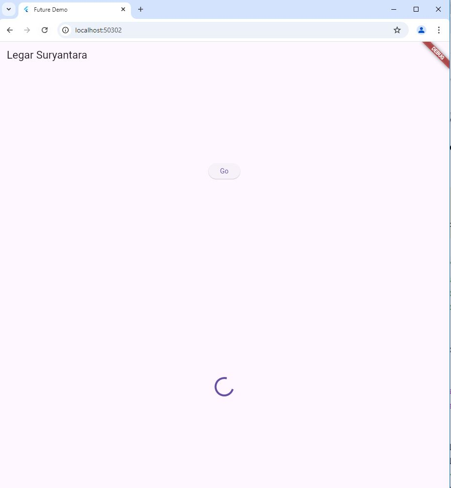
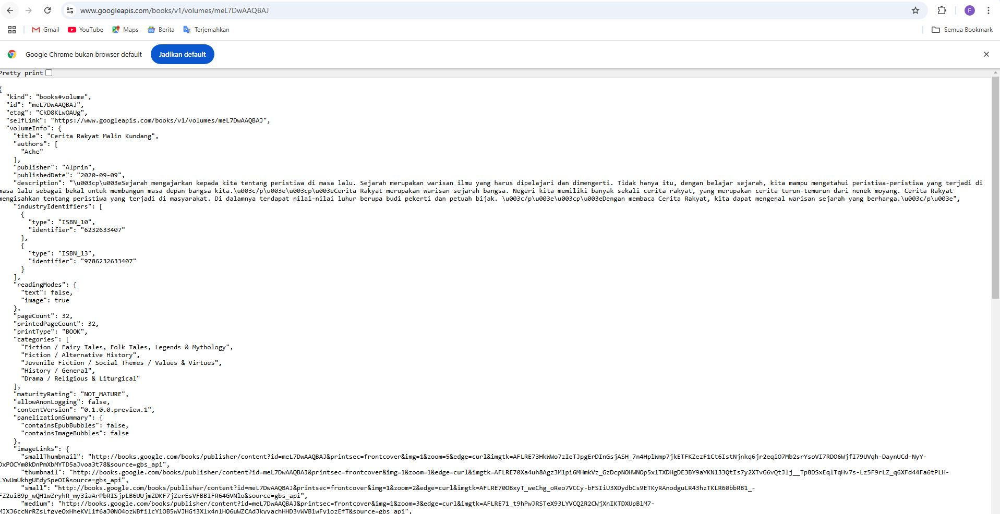
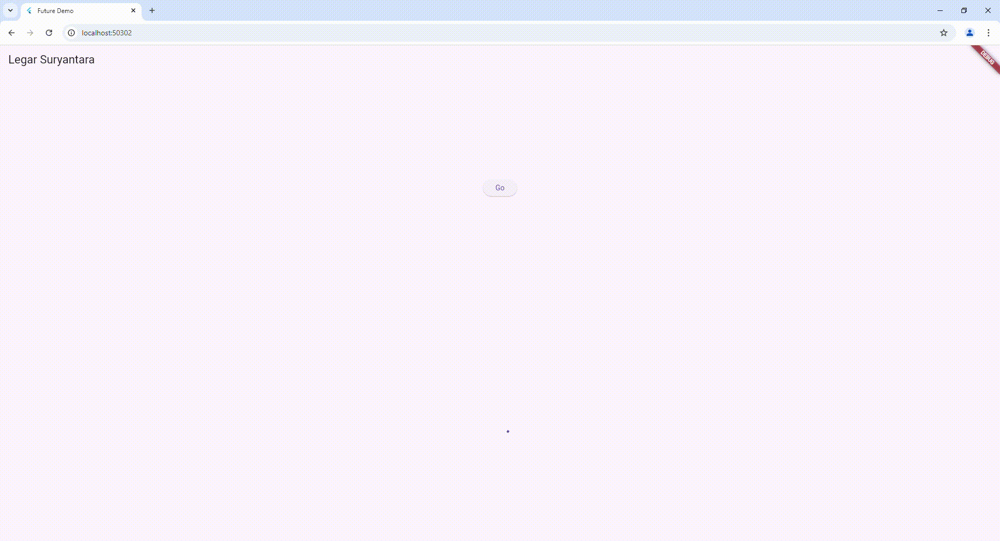

# books

A new Flutter project.

## Getting Started

Soal 1
 
Soal 2
 
Soal 3
 1. Substring adalah bagian dari string yang diambil dari string yang lebih besar. Dalam banyak bahasa pemrograman, Anda dapat menggunakan fungsi atau metode untuk mengekstrak substring dari string.  
 CatchError adalah operator yang digunakan untuk menangani kesalahan (error) yang mungkin terjadi dalam aliran data. Dengan catchError, dapat menangkap kesalahan dan memberikan penanganan alternatif, sehingga program tidak terhenti secara tiba-tiba

Soal 4
1. Langkah 1 dalam kode yang diberikan mendefinisikan tiga fungsi asinkron: returnOneAsync(), returnTwoAsync(), dan returnThreeAsync(), yang masing-masing mengembalikan nilai integer 1, 2, dan 3 setelah menunggu selama 3 detik. Fungsi-fungsi ini menggunakan await Future.delayed(const Duration(seconds: 3)); untuk mensimulasikan operasi yang memerlukan waktu, seperti pengambilan data dari server.  
langkah 2 mendefinisikan fungsi asinkron count(), yang bertujuan untuk menjumlahkan hasil dari ketiga fungsi tersebut. Di dalam fungsi ini, variabel total diinisialisasi dengan nilai 0, kemudian diisi dengan hasil dari masing-masing fungsi secara berurutan menggunakan await, sehingga setelah menjalankan ketiga fungsi, total akan berisi nilai 6. Terakhir, fungsi setState() dipanggil untuk memperbarui state dari widget, sehingga hasil penjumlahan yang baru dapat ditampilkan kepada pengguna.
